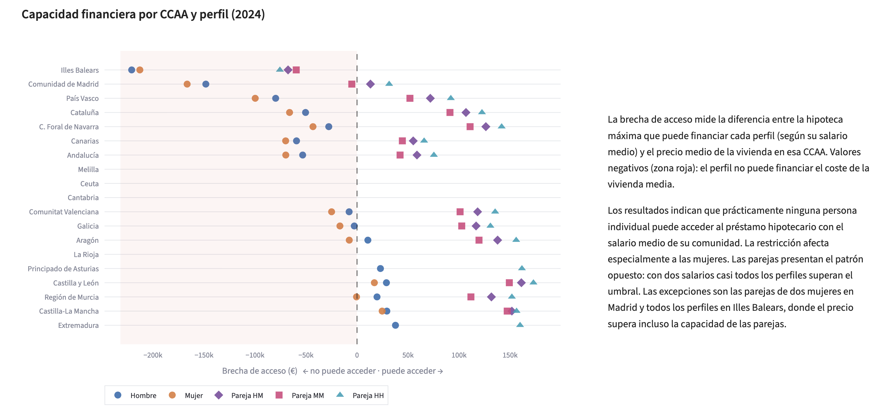

# Acceso a la vivienda en España — ¿Están bien calibrados los programas públicos de primera vivienda?

Proyecto de análisis de datos que evalúa si dos programas públicos de acceso a la primera
vivienda están calibrados a las condiciones reales del mercado: el **aval ICO** (nacional) y el
**Préstec Emancipació** (Cataluña). El análisis se estructura en tres Jupyter notebooks
(Bloque 1–3) y se presenta como una aplicación interactiva en **Streamlit + Plotly**.

🔗 [Aplicación interactiva](https://housing-affordability-spain-project-8lhprtpnjykcfkz6f6lppc.streamlit.app/)



## Hipótesis

- **H1 (Bloque 1):** El tope de precio ICO no cubre los precios registrales reales en los
  mercados con mayor tensión.
- **H2 (Bloque 2):** Aunque el Préstec cubre el precio nominal de compra, la hipoteca
  complementaria (200.000 €) queda fuera del alcance de los perfiles individuales con salario
  medio.
- **H3 (Bloque 3):** El tope de precio de reventa de las viviendas HPO con calificación
  permanente genera una brecha patrimonial acumulada que supera el beneficio inicial del
  préstamo de 50.000 € a lo largo de 30 años.

## Principales hallazgos

- **Ningún perfil individual** con el salario medio de su comunidad puede asumir la hipoteca
  complementaria del Préstec Emancipació en ninguna provincia catalana — solo las parejas
  superan el umbral de 200.000 €.
- **8 de las 19 comunidades autónomas** presentan precios registrales medios por encima del
  tope ICO, lo que significa que el aval no cubre el precio más habitual del mercado en casi
  la mitad del país.
- **Illes Balears** es el caso extremo: incluso los perfiles de pareja con dos ingresos quedan
  por debajo del precio medio de la vivienda.
- **El tope de reventa HPO con calificación permanente** genera una brecha patrimonial
  acumulada de **232.090 €** frente a la revalorización en mercado libre a 30 años en
  Barcelona (65 m²) — más de cuatro veces el beneficio inicial del préstamo de 50.000 €.

## Metodología

- **Capacidad hipotecaria:** modelo estándar — tipo fijo del 3,25 %, plazo de 25 años, ratio
  de endeudamiento máximo del 35 % sobre ingresos netos (criterio Banco de España), factor
  bruto-neto de 0,78. Los perfiles de pareja asumen dos salarios medios a jornada completa
  (escenario optimista).
- **Proyección a 30 años (Bloque 3):** CAGR histórico provincial 2013–2024 como proxy de
  revalorización en mercado libre; IPC histórico mediano (1,95 %) como tasa de crecimiento
  del tope HPO. Modelo determinista con análisis de sensibilidad de ±1 pp.
- **Limitación de los datos:** los precios son medias autonómicas y provinciales sin datos
  distribucionales, por lo que la brecha real en mercados tensionados puede estar subestimada.

## Convención de signos

Brecha negativa = problema (precio supera el tope / perfil no puede acceder) → **rojo**.  
Brecha positiva = el programa cubre el mercado → verde/turquesa.  
La convención es consistente en todas las visualizaciones y los datos subyacentes.

## Fuentes de datos

- Colegio de Registradores — precios de transacciones residenciales por comunidad autónoma
- Idescat / Departament de Territori — precios provinciales catalanes y series de IPC
- INE Encuesta Anual de Estructura Salarial — salarios del tramo 25–34 años por sexo y CCAA
- Condiciones oficiales de los programas ICO e ICF

## Estructura del proyecto

```
Housing-affordability-spain-project/
├── app.py                  # App Streamlit (tema claro, gráficos Plotly)
├── Data/                   # fuentes originales + CSVs procesados (b1_*, b2_*, b3_*)
├── Notebooks/              # tres bloques de análisis
├── .streamlit/config.toml  # configuración de tema
├── requirements.txt
└── README.md
```

Los DataFrames procesados se exportan desde los notebooks a `Data/` como CSVs con prefijo
`b1_`, `b2_`, `b3_` y se cargan en la app mediante `@st.cache_data`.

## Ejecución local

```bash
pip install -r requirements.txt
streamlit run app.py
```
